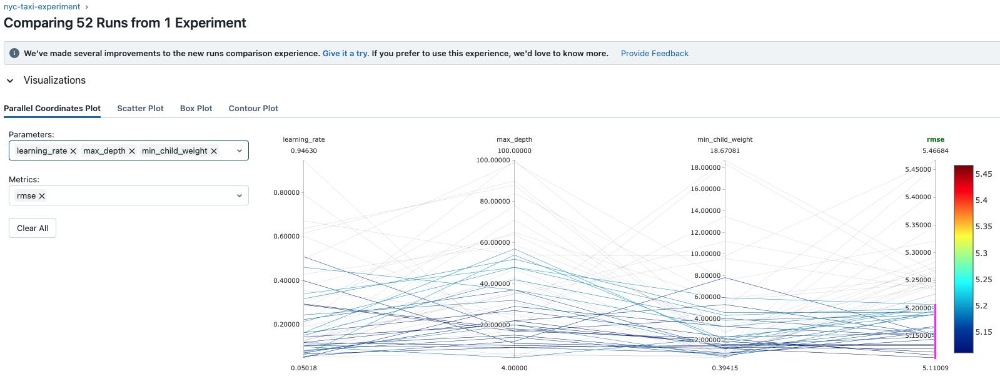
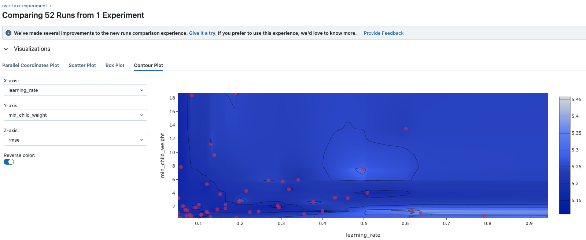
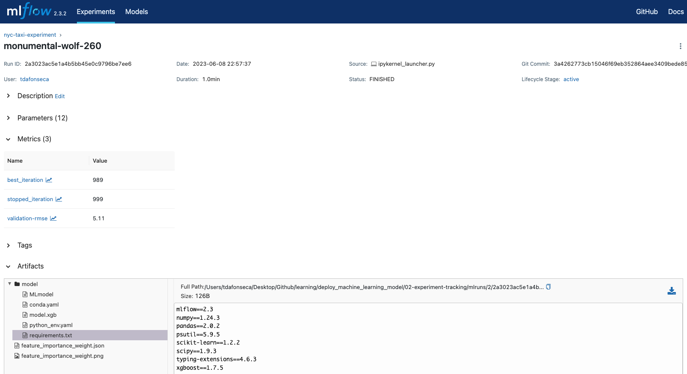
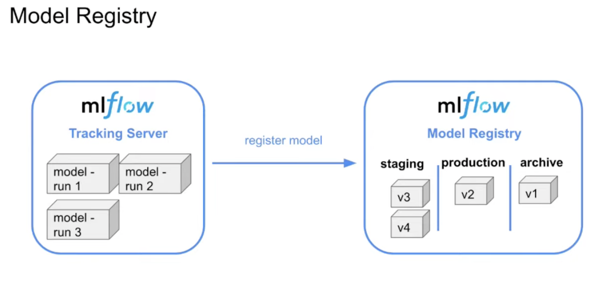

# Welcome to a repository focused on deploying Machine Learning models to production!

### Poetry Commands
Run the following command line to start using Poetry:<br />
1-Clean Cache
```commandline
poetry cache clear --all pypi
```
2-Update poetry
```commandline
poetry self update
```
3-Activate virtual environment
```commandline
poetry shell
```
4-Add dependency with virtual environment on
```commandline
poetry add <package>
```
5-Add notebook kernel so, that dependencies are managed automatically
```commandline
python -m ipykernel install --user --name=<package>
```
6-Run jupyter notebooks, note when you run the following command it does implicitly activate the virtual environment
```commandline
poetry run jupyter notebook
```
7-In your notebook, target to the new kernel created in <5> <br />
8-Get NYC taxi data for March 2023
```commandline
curl -O https://d37ci6vzurychx.cloudfront.net/trip-data/green_tripdata_2023-03.parquet
```


## Project design


## Overview
### [1: Introduction]
- Predict New York taxi durations using Linear Regression

### [2: Experiment tracking]
- Use Mlflow to track our model performance developed in [1: Introduction]
```commandline
 mlflow ui  --backend-store-uri sqlite:///mlflow.db
```
### M.L. experiment tracking


### All xgboost model performances


### All XGboost model heatmap


### Best XGboost model performance


### Model management


#### Remote tracking server
The tracking server can be easily deployed to the cloud
Some benefits:
- Share experiments with other data scientists
- Collaborate with other to build and deploy models
- Give more visibility of the data science efforts

##### Issues with running a remote (shared) MLflow server
- Security
    -   Restrict access to the server (e.g. access through VPN)
- Scalability
- Isolation
    - Define standard for naming experiments, models and a set of default tags
    - Restrict access to artifacts (e.g. use s3 buckets living in different AWS accounts)


### [3: Orchestration]
<b>Prefect</b> is the tool, it will solve:
- Set up pipeline to train a model
- Set up logging
- Run everyday
- Retry if fails
- Send a message if succeeds
- Visualize dependencies
- Caching
- Add collaborators to run ad hoc

```commandline
poetry add -D --dev <path-to-requirements.txt>
```