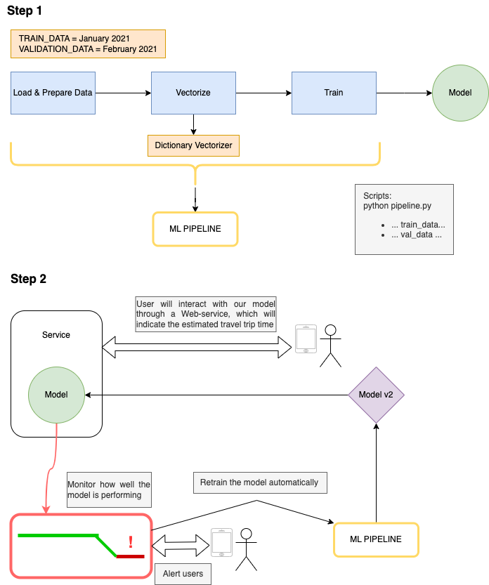
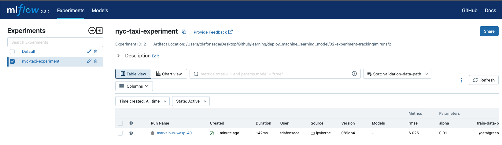

# Welcome to a repository focused on deploying Machine Learning models to production!

### Poetry Commands
Run the following command line to start using Poetry:<br />
1-Clean Cache
```commandline
poetry cache clear --all pypi
```
2-Update poetry
```commandline
poetry self update
```
3-Activate virtual environment
```commandline
poetry shell
```
4-Add dependency with virtual environment on
```commandline
poetry add <package>
```
5-Add notebook kernel so, that dependencies are managed automatically
```commandline
python -m ipykernel install --user --name=<package>
```
6-Run jupyter notebooks, note when you run the following command it does implicitly activate the virtual environment
```commandline
poetry run jupyter notebook
```
7-In your notebook, target to the new kernel created in <5> <br />

## Project design


## Overview
### [1: Introduction]
- Predict New York taxi durations using Linear Regression

### [2: Experiment tracking]
- Use Mlflow to track our model performance developed in [1: Introduction]
```commandline
 mlflow ui  --backend-store-uri sqlite:///mlflow.db
```
